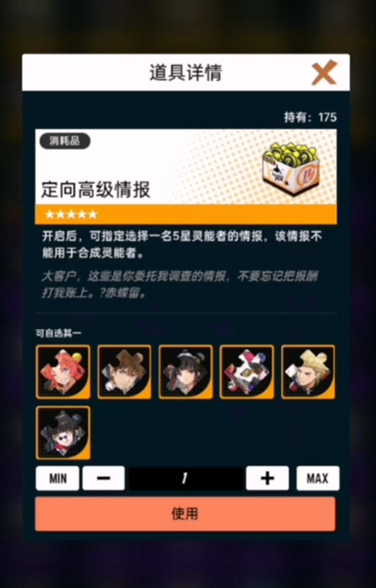
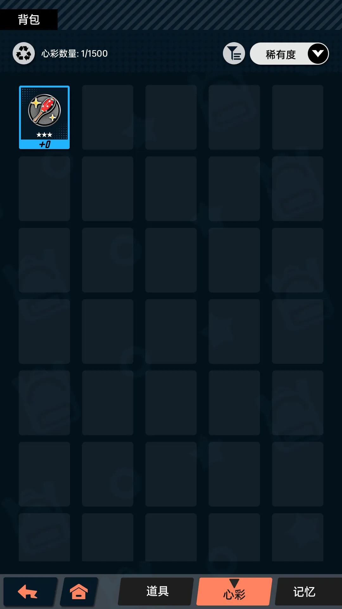

## 奶油

### [背包系统](../cream/PackageSys/)

**🎯达成目标（需求）**

- UI 界面需求
  - [ ] 静态资源收集添加
  - [ ] 背包弹窗界面
  - [ ] 背包物品列表
  - [ ] 物品详情tip界面
  - [ ] 物品类型切换
  - [ ] 物品搜索筛选排序

- 背包功能需求
  - [ ] 背包物品数据结构（类型，数量，红点，详情）
  - [ ] 背包物品数据加载，保存，删除
  - [ ] 背包物品类型切换，数据筛选，排序
  - [ ] 背包物品详情tip界面
  - [ ] 背包物品增加，减少（使用，获取）
  - [ ] 物品使用，个数选择器

**📚资料素材（参考）**

[飞跃虹镜】界面截图](https://www.gameui.net/game/12985)

[【飞跃虹镜】零氪通关，全角色，游戏建议，附角色属性](https://www.bilibili.com/video/BV1G2hrerEKn)

