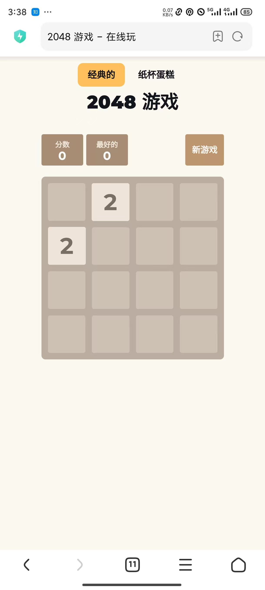

## 果盘

### [2048](../fruit/cake2048/)

**🎯达成目标（需求）**

- [X] 棋盘布局，用户布局
- 基本2048游戏逻辑
  - [X] 滑动方向监听
  - [X] 初始化棋盘数据
  - [X] 生成棋子
  - [X] 棋子移动逻辑
  - [X] 棋子合成逻辑
  - [X] 分数计算
  - [X] 重新开始

**📚资料素材（参考）**

[原先写过的js版本 2048](https://github.com/onlyLucky/2048)